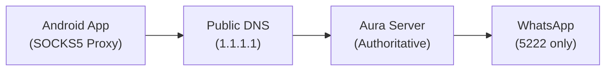

# Aura Complete System Architecture

## Overview
Aura is a DNS-based tunneling system designed to proxy WhatsApp text messages through public DNS infrastructure.

**Key Constraint**: TEXT-ONLY - Filters traffic to port 5222 exclusively, blocking media/CDN connections.

## Architecture

```
┌─────────────────┐         ┌──────────────┐         ┌──────────────────┐         ┌─────────────┐
│  Android App    │─────────│  Public DNS  │─────────│  Aura Server     │─────────│  WhatsApp   │
│  (SOCKS5 Proxy) │         │  (1.1.1.1)   │         │  (Authoritative) │         │  (5222 only)│
│  127.0.0.1:1080 │         │              │         │  (Australia)     │         │             │
└─────────────────┘         └──────────────┘         └──────────────────┘         └─────────────┘
     DNS queries →              Forward →                Process query              Connect to
     AAAA records            to your domain             Extract data               e1.whatsapp.net:5222
```



## Protocol Specification

### DNS Query Format
Every DNS query follows this structure:
```
[Nonce]-[Seq]-[SessionID].[Base32Data].tunnel.example.com.
```

**Components:**
- **Nonce**: 4-character hex (e.g., `a3f1`) - Random value for cache busting
- **Seq**: 4-character hex (e.g., `0001`) - Sequence number for ordering
- **SessionID**: 4-character hex (e.g., `b2c4`) - Unique session identifier
- **Base32Data**: Variable-length Base32-encoded payload (lowercase, no padding)

**Example Query:**
```
a3f1-0001-b2c4.mzxw6ytboi.tunnel.example.com.
```

### Data Flow

#### Upstream (Client → Server)
1. **Fragmentation**: Split TCP data into 30-byte chunks
2. **Encoding**: Base32 encode each chunk (no padding, lowercase)
3. **DNS Query**: Send as AAAA query with structure above
4. **Server Processing**:
   - Parse query name to extract nonce, seq, sessionID, data
   - Decode Base32 data
   - Forward to WhatsApp connection (port 5222 ONLY)
   - Return empty AAAA response (acknowledgment)

#### Downstream (Server → Client)
1. **Client Polling**: Send special query with seq=`ffff`
   ```
   [nonce]-ffff-[sessionID]..tunnel.example.com.
   ```
2. **Server Response**:
   - Check session buffer for pending data
   - Pack data into IPv6 addresses (16 bytes per AAAA record)
   - Return multiple AAAA records if needed
3. **Client Processing**:
   - Extract 16 bytes from each IPv6 address
   - Concatenate all records
   - Write to TCP connection

### Cache Busting
**Purpose**: Prevent DNS caching from interfering with real-time communication.

**Implementation**:
- Generate random 4-hex-character nonce for each query
- Ensures every query is unique
- DNS resolvers cannot cache responses

**Code Example** (client.go):
```go
nonce := randomHex(4) // e.g., "a3f1"
qname := fmt.Sprintf("%s-%04x-%s.%s.%s", nonce, seq, c.SessionID, label, DomainSuffix)
```

## Port 5222 Enforcement (TEXT-ONLY)

### Why Port 5222?
WhatsApp uses different ports for different traffic types:
- **Port 5222**: XMPP text messaging (our target)
- **Port 443**: Media, voice, CDN (blocked by Aura)

### Server-Side Enforcement
Located in `internal/server.go`:

```go
func (s *Server) getSession(sid string, qname string) (*session, error) {
    // ... session lookup ...
    
    // TEXT-ONLY ENFORCEMENT: Block all non-5222 connections
    if strings.Contains(qname, "media") || strings.Contains(qname, "cdn") {
        return nil, fmt.Errorf("media/CDN traffic blocked")
    }
    
    // ONLY connect to WhatsApp port 5222
    conn, err := net.DialTimeout("tcp", WhatsAppHost+":5222", 5*time.Second)
    if err != nil {
        return nil, err
    }
    
    // ... session creation ...
}
```

**Key Points:**
- Hardcoded port 5222 in connection string
- Rejects queries containing "media" or "cdn" subdomains
- All WhatsApp traffic must go through text messaging port

## Android Integration

### Prerequisites
```bash
# Install gomobile
go install golang.org/x/mobile/cmd/gomobile@latest
gomobile init

# Install Android SDK/NDK
# Set ANDROID_HOME and ANDROID_NDK_HOME environment variables
```

### Build Android Library (.aar)

#### Step 1: Ensure mobile.go exports are gomobile-compatible
File: `internal/mobile.go`
```go
package internal

import "context"

var (
    globalClient *AuraClient
    globalCancel context.CancelFunc
)

// StartAuraClient starts the Aura SOCKS5 proxy on 127.0.0.1:1080
// dnsServer example: "1.1.1.1:53"
// domain example: "tunnel.example.com."
func StartAuraClient(dnsServer, domain string) error {
    if globalClient != nil {
        StopAuraClient()
    }
    
    ctx, cancel := context.WithCancel(context.Background())
    globalCancel = cancel
    
    globalClient = NewAuraClient(dnsServer)
    go func() {
        err := globalClient.StartSocks5(ctx, domain)
        if err != nil {
            // Log error
        }
    }()
    return nil
}

// StopAuraClient gracefully stops the proxy
func StopAuraClient() {
    if globalCancel != nil {
        globalCancel()
    }
    globalClient = nil
}
```

#### Step 2: Build .aar file
```bash
cd /path/to/Aura

# For Android ARM64 + x86_64 (most common)
gomobile bind -target=android/arm64,android/amd64 -o aura.aar ./internal

# Output: aura.aar and aura-sources.jar
```

**Output Files:**
- `aura.aar` - Android library (place in `app/libs/`)
- `aura-sources.jar` - Source code for IDE navigation

#### Step 3: Android Project Setup

**build.gradle (Module: app)**
```gradle
dependencies {
    implementation files('libs/aura.aar')
    // ... other dependencies
}
```

**AndroidManifest.xml**
```xml
<uses-permission android:name="android.permission.INTERNET" />
<uses-permission android:name="android.permission.BIND_VPN_SERVICE" />

<application>
    <service
        android:name=".AuraVpnService"
        android:permission="android.permission.BIND_VPN_SERVICE">
        <intent-filter>
            <action android:name="android.net.VpnService" />
        </intent-filter>
    </service>
</application>
```

#### Step 4: VpnService Implementation (Java/Kotlin)

**AuraVpnService.kt**
```kotlin
package com.example.aura

import android.content.Intent
import android.net.VpnService
import android.os.ParcelFileDescriptor
import internal.Internal // Generated from gomobile

class AuraVpnService : VpnService() {
    private var vpnInterface: ParcelFileDescriptor? = null
    
    override fun onStartCommand(intent: Intent?, flags: Int, startId: Int): Int {
        // Create VPN interface
        val builder = Builder()
        builder.setSession("Aura VPN")
        builder.addAddress("10.0.0.2", 32)
        builder.addRoute("0.0.0.0", 0)
        builder.addDnsServer("1.1.1.1")
        vpnInterface = builder.establish()
        
        // Start Aura SOCKS5 proxy
        Internal.startAuraClient("1.1.1.1:53", "tunnel.example.com.")
        
        // TODO: Route VPN traffic to 127.0.0.1:1080 (SOCKS5)
        // This requires packet forwarding implementation
        
        return START_STICKY
    }
    
    override fun onDestroy() {
        Internal.stopAuraClient()
        vpnInterface?.close()
        super.onDestroy()
    }
}
```

**MainActivity.kt**
```kotlin
package com.example.aura

import android.content.Intent
import android.net.VpnService
import androidx.appcompat.app.AppCompatActivity
import internal.Internal

class MainActivity : AppCompatActivity() {
    private val VPN_REQUEST_CODE = 1
    
    fun startVpn() {
        val intent = VpnService.prepare(applicationContext)
        if (intent != null) {
            startActivityForResult(intent, VPN_REQUEST_CODE)
        } else {
            onActivityResult(VPN_REQUEST_CODE, RESULT_OK, null)
        }
    }
    
    override fun onActivityResult(requestCode: Int, resultCode: Int, data: Intent?) {
        if (requestCode == VPN_REQUEST_CODE && resultCode == RESULT_OK) {
            val serviceIntent = Intent(this, AuraVpnService::class.java)
            startService(serviceIntent)
        }
    }
    
    fun stopVpn() {
        val serviceIntent = Intent(this, AuraVpnService::class.java)
        stopService(serviceIntent)
    }
}
```

## Testing in Termux

### Server Setup (Australian VPS)
```bash
# Install Go 1.21+
# Clone repository
git clone https://github.com/ArashDoDo2/Aura
cd Aura

# Build server
go build -o aura-server ./cmd/server

# Configure DNS zone delegation (point your domain NS to your server IP)
# Run server (requires root for port 53)
sudo ./aura-server -addr :53 -domain tunnel.example.com.
```

### Client Testing (Termux on Android)
```bash
# Install dependencies
pkg install golang git

# Clone and build
git clone https://github.com/ArashDoDo2/Aura
cd Aura
go build -o aura-client ./cmd/client

# Run client
./aura-client -dns 1.1.1.1:53 -domain tunnel.example.com.

# Client starts SOCKS5 proxy on 127.0.0.1:1080

# Test with WhatsApp (requires SOCKS5-capable client or VPN setup)
# For manual testing:
curl --socks5 127.0.0.1:1080 http://e1.whatsapp.net:5222
```

## Protocol Details

### AAAA Record Encoding
Each AAAA record carries 16 bytes of payload in IPv6 format:
```go
// Pack 16 bytes into IPv6 address
func PackDataToIPv6(data []byte) net.IP {
    if len(data) > 16 {
        data = data[:16]
    }
    ip := make([]byte, 16)
    copy(ip, data)
    return net.IP(ip)
}

// Unpack IPv6 address to bytes
func UnpackIPv6ToData(ip net.IP) []byte {
    return []byte(ip)[:16]
}
```

### Base32 Encoding
Standard Base32 with modifications for DNS compatibility:
```go
var b32Encoder = base32.StdEncoding.WithPadding(base32.NoPadding)

func EncodeDataToLabel(data []byte) string {
    return strings.ToLower(b32Encoder.EncodeToString(data))
}

func DecodeLabelToData(label string) ([]byte, error) {
    label = strings.ToUpper(label)
    return b32Encoder.DecodeString(label)
}
```

**Why Base32?**
- DNS labels only support [a-z0-9-]
- Base64 contains invalid characters (+, /, =)
- Base32 uses [A-Z2-7], safe when lowercased

### Session Management
- **Session Creation**: First query with new sessionID creates TCP connection to WhatsApp
- **Session Timeout**: 60 seconds of inactivity closes session
- **Background Reader**: Dedicated goroutine per session continuously reads from target
- **Sequence Ordering**: Server maintains `pendingChunks` map to handle out-of-order packets
- **TLS Optimization**: Buffers complete ClientHello before transmission (single-write)

**Session Lifecycle** (server.go):
```go
type session struct {
    conn                 net.Conn      // TCP connection to e1.whatsapp.net:5222
    buffer               []byte        // Pending downstream data
    lastSeen             time.Time     // For timeout tracking
    mu                   sync.Mutex
    pendingChunks        map[uint16][]byte  // Out-of-order packet buffering
    expectedSeq          uint16             // Next expected sequence number
    tlsHandshakePending  bool
    tlsHandshakeExpected int
    tlsHandshakeBuffer   []byte
    handshakeDone        bool
}

// Background reader goroutine per session
func (s *session) startReader(sid string) {
    buf := make([]byte, MaxIPv6Payload*10)
    for {
        n, err := s.conn.Read(buf)
        if n > 0 {
            s.mu.Lock()
            s.buffer = append(s.buffer, buf[:n]...)
            s.mu.Unlock()
        }
        if err != nil {
            return
        }
    }
}

// Sequence-aware chunk processing
func (s *session) processPendingChunks(qf *QueryFields) {
    for {
        chunk, ok := s.pendingChunks[s.expectedSeq]
        if !ok {
            break
        }
        delete(s.pendingChunks, s.expectedSeq)
        // Process chunk (TLS buffering or direct write)
        s.expectedSeq++
    }
}

// Background cleanup
func (s *Server) sessionTimeoutWatcher() {
    for {
        time.Sleep(10 * time.Second)
        s.mu.Lock()
        for sid, sess := range s.sessions {
            if time.Since(sess.lastSeen) > SessionTimeout {
                sess.conn.Close()
                delete(s.sessions, sid)
            }
        }
        s.mu.Unlock()
    }
}
```

## Limitations & Caveats

1. **TEXT-ONLY**: Only WhatsApp text messages work. Voice calls, media, status updates blocked.
2. **Latency**: DNS queries add significant latency (500ms+ typical)
3. **Throughput**: Limited by DNS query rate (~100 queries/sec max)
4. **Public DNS Dependency**: Relies on public DNS not blocking high query volumes
5. **Android VPN Complexity**: Full VPN implementation requires packet-level routing
6. **Security**: No encryption beyond DNS transport layer (consider HTTPS/DoH)

## File Structure
```
Aura/
├── cmd/
│   ├── client/main.go    # Client entry point (for Termux testing)
│   └── server/main.go    # Server entry point (for VPS deployment)
├── internal/
│   ├── server.go         # Authoritative DNS server + WhatsApp connection
│   ├── client.go         # SOCKS5 proxy + DNS tunnel client
│   ├── mobile.go         # gomobile exports for Android
│   ├── dnsutil.go        # Base32/IPv6 encoding utilities
│   └── protocol.go       # DNS query name builder
├── COMPLETE-ARCHITECTURE.md  # This file
├── ANDROID-BUILD.md      # Android-specific build instructions
├── PROJECT-GO.md         # Go project documentation
└── README.md             # Project overview
```

## Security Considerations

1. **DNS Queries are Visible**: ISPs can see domain names in queries
2. **No End-to-End Encryption**: Traffic visible to DNS resolver and server
3. **WhatsApp E2EE Intact**: WhatsApp's own encryption still protects message content
4. **Server Trust**: You must trust the Aura server operator (run your own!)

## Performance Tuning

### Client
- Adjust `PollInterval` (currently 500ms) for latency vs. efficiency tradeoff
- Increase `MaxChunkSize` (currently 30 bytes) if DNS labels support it

### Server
- Use connection pooling for WhatsApp connections (currently one per session)
- Implement rate limiting to avoid DNS query floods
- Monitor buffer sizes to prevent memory exhaustion

## Deployment Checklist

### Server
- [ ] Register a domain (e.g., tunnel.example.com)
- [ ] Configure DNS NS records to point to your server IP
- [ ] Open firewall port 53 (UDP)
- [ ] Build and deploy aura-server
- [ ] Set up systemd service for auto-restart
- [ ] Monitor logs for abuse/errors

### Android App
- [ ] Build .aar with gomobile
- [ ] Implement complete VpnService with packet routing
- [ ] Add UI for DNS server and domain configuration
- [ ] Request VPN permission from user
- [ ] Handle connection errors gracefully
- [ ] Add status indicators (connected/disconnected)
- [ ] Test with actual WhatsApp traffic

## Troubleshooting

### Client Cannot Connect
- Verify DNS server is reachable: `nslookup tunnel.example.com 1.1.1.1`
- Check SOCKS5 proxy: `netstat -an | grep 1080`
- Enable debug logging in client.go

### Server Not Responding
- Verify DNS service running: `sudo netstat -ulnp | grep :53`
- Check server logs for errors
- Test DNS resolution: `dig @<server-ip> test.tunnel.example.com AAAA`

### WhatsApp Not Working
- Confirm only port 5222 traffic attempted (check server logs)
- Verify WhatsApp server reachable: `nc -v e1.whatsapp.net 5222`
- Check session timeout (increase if needed)

---

**Aura Project**: DNS-based WhatsApp text-only proxy through public DNS infrastructure.
**Author**: ArashDoDo2
**Repository**: https://github.com/ArashDoDo2/Aura
