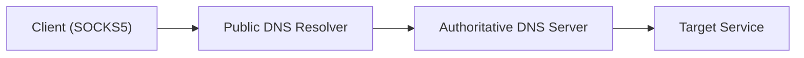

# Aura – DNS-Based Network Tunneling Platform

**Aura** is an advanced DNS tunneling system designed for low-observable network communication. It leverages standard DNS infrastructure to establish covert data channels, enabling connectivity in restrictive network environments.

## 🎯 Core Architecture

```
Client (SOCKS5) → Public DNS Resolver → Authoritative DNS Server → Target Service
```



**Key Innovation**: All data transmission occurs through DNS AAAA record queries, allowing traffic to traverse networks where only DNS is permitted.

## ✨ Technical Highlights

- **Protocol**: DNS-only transport via AAAA records (IPv6 addresses)
- **Encoding**: Base32 with custom adaptation for DNS compatibility
- **Payload**: 16-byte chunks per DNS response (IPv6 address space)
- **Upstream**: 30-byte fragmentation with Base32 encoding
- **Cache Evasion**: Cryptographic nonce injection per query
- **Session Management**: Automatic 60-second timeout with background cleanup
- **Port Filtering**: Configurable target port enforcement (default: 5222)
- **Cross-Platform**: Pure Go implementation, gomobile-compatible for Android

## 🚀 Quick Start

### Server Deployment

Configure your authoritative DNS server for any domain:

```bash
# Environment variables
export AURA_DOMAIN="yourdomain.com."
export AURA_LISTEN_ADDR=":53"

# Start server (requires root/CAP_NET_BIND_SERVICE for port 53)
sudo ./aura-server

# Or with flags
sudo ./aura-server -domain yourdomain.com. -addr :53
```

### Client Configuration

Set up SOCKS5 proxy with configurable parameters:

```bash
# Using system DNS resolver (recommended for most users)
export AURA_DOMAIN="yourdomain.com."
export AURA_SOCKS5_PORT="1080"
./aura-client

# With custom DNS server
export AURA_DNS_SERVER="1.1.1.1:53"
export AURA_DOMAIN="yourdomain.com."
export AURA_SOCKS5_PORT="1080"
./aura-client

# Or with flags
./aura-client -dns 1.1.1.1:53 -domain yourdomain.com. -port 1080

# Use system resolver (leave DNS empty)
./aura-client -dns "" -domain yourdomain.com. -port 1080
```

> **Pro Tip:** Omit `AURA_DNS_SERVER` to automatically use your system's DNS configuration. Perfect for dynamic network environments!

## 📦 Installation

### From Source

```bash
# Prerequisites: Go 1.21+
git clone https://github.com/ArashDoDo2/Aura
cd Aura

# Build binaries
go build -o aura-server ./cmd/server
go build -o aura-client ./cmd/client
```

### Android Library (.aar)

```bash
# Install gomobile
go install golang.org/x/mobile/cmd/gomobile@latest
gomobile init

# Build Android library
gomobile bind -target=android/arm64,android/amd64 -o aura.aar ./internal
```

## 🔧 Configuration

### Environment Variables

**Server:**
- `AURA_DOMAIN` - Authoritative domain (e.g., `tunnel.example.com.`)
- `AURA_LISTEN_ADDR` - Listen address (default `:53`)

**Client:**
- `AURA_DNS_SERVER` - Upstream DNS resolver (optional, defaults to system resolver)
- `AURA_DOMAIN` - Target domain matching server configuration
- `AURA_SOCKS5_PORT` - Local SOCKS5 proxy port (default `1080`)

> **Note:** If `AURA_DNS_SERVER` is not specified, the client will automatically use your system's default DNS resolver (reading from `/etc/resolv.conf`). This is ideal for mobile apps where users may not know DNS server addresses.

### DNS Configuration

Point your domain's NS records to your server's IP address:

```
tunnel.example.com.  IN  NS  ns1.yourserver.com.
ns1.yourserver.com.  IN  A   203.0.113.10
```

## 🏗️ Protocol Specification

### DNS Query Structure
```
[Nonce]-[Seq]-[SessionID].[Base32Data].<domain>
```

**Components:**
- **Nonce**: 4-character hex (cache busting)
- **Seq**: 4-character hex (packet ordering, ffff=poll)
- **SessionID**: 4-character hex (session identifier)
- **Base32Data**: Payload encoded for DNS compatibility

**Example:**
```
a3f1-0001-b2c4.mzxw6ytboi.tunnel.example.com.
```

### Data Flow

#### Upstream (Client → Server)
1. Fragment TCP stream into 30-byte chunks
2. Base32 encode each chunk
3. Construct DNS AAAA query with encoded data
4. Server extracts and forwards to target

#### Downstream (Server → Client)
1. Client polls with special sequence (ffff)
2. Server packs pending data into IPv6 addresses (16 bytes each)
3. Multiple AAAA records returned if needed
4. Client extracts and reassembles data

## 📱 Android Integration

```kotlin
// Start SOCKS5 proxy
import internal.Internal

Internal.startAuraClient(
    "",                      // DNS server (empty = use system resolver)
    "tunnel.example.com.",   // Domain
    1080                     // SOCKS5 port
)

// With custom DNS server
Internal.startAuraClient(
    "1.1.1.1:53",           // Custom DNS server
    "tunnel.example.com.",  // Domain
    1080                    // SOCKS5 port
)

// Stop proxy
Internal.stopAuraClient()
```

> **Tip for Android UI:** Leave DNS server field empty to automatically use device's network DNS settings. This simplifies configuration for end users.

**Full VpnService implementation available in [COMPLETE-ARCHITECTURE.md](COMPLETE-ARCHITECTURE.md)**

## 🎭 Use Cases

✅ **Supported Scenarios:**
- Network environments with restrictive firewalls
- DNS-only connectivity situations
- Covert channel research and testing
- Educational purposes for network protocols

❌ **Limitations:**
- High latency (~500ms+ per round-trip)
- Limited throughput (~100 queries/sec)
- Not suitable for real-time applications
- Dependent on public DNS infrastructure

## 📊 Performance Characteristics

- **Latency**: 500-1000ms typical
- **Throughput**: ~5-10 KB/s (DNS rate-limited)
- **Overhead**: ~3x data expansion (Base32 + DNS headers)
- **Session Timeout**: 60 seconds idle
- **Max Payload**: 16 bytes per DNS response

## 🔒 Security Considerations

⚠️ **Important Security Notes:**
- DNS queries are visible to network operators
- No built-in encryption beyond transport layer
- Recommend running your own DNS resolver
- Consider DNS-over-HTTPS (DoH) for additional privacy
- End-to-end encryption should be implemented at application layer

## 📚 Documentation

- **[COMPLETE-ARCHITECTURE.md](COMPLETE-ARCHITECTURE.md)** - Comprehensive system design and protocol details
- **[TECHNICAL-SPEC.md](TECHNICAL-SPEC.md)** - Architecture spec with sequence diagrams and session state machine
- **[ANDROID-BUILD.md](ANDROID-BUILD.md)** - Mobile integration guide
- **[PROJECT-GO.md](PROJECT-GO.md)** - Development documentation

## 🛠️ Development

```bash
# Run tests
go test ./...

# Format code
go fmt ./...

# Build for multiple platforms
GOOS=linux GOARCH=amd64 go build -o aura-server-linux ./cmd/server
GOOS=windows GOARCH=amd64 go build -o aura-client.exe ./cmd/client
```

## 🤝 Contributing

Contributions welcome! Areas of interest:
- Performance optimizations
- Additional transport protocols
- Enhanced Android VpnService implementation
- Documentation improvements
- Protocol security enhancements

## 📄 License

MIT License - See [LICENSE](LICENSE) file for details

## ⚠️ Disclaimer

This tool is for educational and research purposes. Users are responsible for compliance with applicable laws and network policies. Unauthorized network tunneling may violate terms of service or local regulations.

## 👤 Author

**ArashDoDo2**  
GitHub: [@ArashDoDo2](https://github.com/ArashDoDo2)

---

**Project Status**: Production-ready for experimental/research use  
**Go Version**: 1.21+  
**Protocol**: DNS AAAA (IPv6)  
**Architecture**: Client-Server with SOCKS5 proxy
